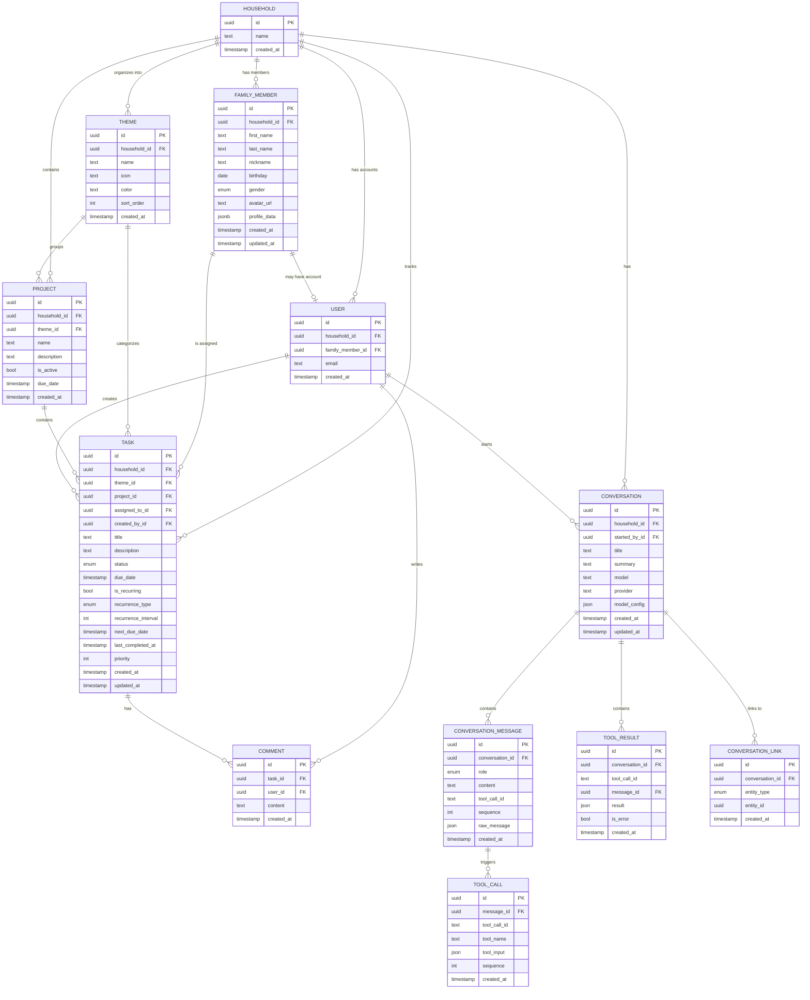

# Home Management AI System — Design Document

## Overview

A household management application that helps busy families coordinate tasks, track responsibilities, and leverage AI assistance to reduce cognitive load. The system provides shared visibility into what needs to be done, who's doing it, and surfaces timely reminders for recurring maintenance.

### Core Problems Solved

1. **Shared Visibility** — Both parents see the same picture of what needs doing, what's been decided, and what's in progress
2. **Task Coordination** — Assigning, tracking, and completing tasks (one-off and recurring)
3. **Recurring Maintenance** — Tracking things like filter changes, car maintenance, water heater service with proactive reminders
4. **AI Assistance** — Conversational AI that can help plan, suggest, create tasks, and reduce friction

### Target Users

- A single household (initially 2 adults)
- Authentication restricted to specific Google accounts
- Designed for mobile-first usage via PWA

---

## Technical Stack

| Layer                | Technology                 | Notes                                          |
| -------------------- | -------------------------- | ---------------------------------------------- |
| **Monorepo**         | Turborepo                  | Shared packages, single repo                   |
| **Frontend**         | Next.js 14+ (App Router)   | React Server Components, PWA support           |
| **Frontend Hosting** | Vercel                     | Edge CDN, preview deploys                      |
| **Styling**          | Tailwind CSS               | Utility-first, mobile-responsive               |
| **Components**       | shadcn/ui (Base UI)        | Accessible, composable components              |
| **Backend**          | DBOS + Hono/Express        | Durable workflows, scheduled tasks             |
| **Backend Hosting**  | GCP Cloud Run              | Always-on container                            |
| **Database**         | Neon (Serverless Postgres) | Connection pooling built-in                    |
| **ORM**              | Drizzle ORM                | Type-safe, lightweight                         |
| **Auth**             | NextAuth.js v5             | Google OAuth, restricted to allowlist          |
| **AI**               | Vercel AI SDK              | Unified provider abstraction, streaming, hooks |
| **Notifications**    | Web Push API               | PWA notifications                              |

Shadcn starter for the frontend

yarn dlx shadcn@latest create --preset "https://ui.shadcn.com/init?base=base&style=vega&baseColor=stone&theme=blue&iconLibrary=lucide&font=figtree&menuAccent=subtle&menuColor=default&radius=small&template=next&rtl=false" --template next

Should be fully runnable locally for rapid development cycles

The backend should implement using zod openapi so that there is validation and expose an auto generated openapi.json so that a client can be generated for the frontend using hey openapi with tanstack query

---

## Architecture Overview

```
┌─────────────────────┐         ┌─────────────────────┐
│      Vercel         │         │   GCP Cloud Run     │
│   ┌─────────────┐   │         │   ┌─────────────┐   │
│   │  Next.js    │   │  HTTP   │   │   DBOS      │   │
│   │  Frontend   │──────────────▶  │   Backend   │   │
│   │  (PWA)      │   │         │   │   Server    │   │
│   └─────────────┘   │         │   └──────┬──────┘   │
└─────────────────────┘         └──────────┼──────────┘
                                           │
                                ┌──────────▼──────────┐
                                │       Neon          │
                                │  (Serverless PG)    │
                                │  ┌───────────────┐  │
                                │  │ App Tables    │  │
                                │  │ DBOS Tables   │  │
                                │  └───────────────┘  │
                                └─────────────────────┘
```

**Frontend (Vercel):** Next.js PWA handles UI, auth session, and calls backend API

**Backend (GCP Cloud Run):** DBOS server handles:

- All data mutations (tasks, projects, themes, etc.)
- AI chat with tool execution
- Scheduled jobs (recurring task reminders, maintenance alerts)
- Durable workflows (multi-step processes)

**Database (Neon):** Single Postgres instance stores both app data and DBOS system tables

---

## Monorepo Structure

```
home-management/
├── apps/
│   ├── web/                    # Next.js frontend (Vercel)
│   │   ├── app/                # App router pages
│   │   │   ├── (auth)/         # Auth pages (login)
│   │   │   ├── (dashboard)/    # Main app pages
│   │   │   │   ├── tasks/
│   │   │   │   ├── projects/
│   │   │   │   ├── themes/
│   │   │   │   ├── family/
│   │   │   │   ├── chat/
│   │   │   │   └── settings/
│   │   │   ├── api/            # Minimal API routes (auth only)
│   │   │   │   └── auth/
│   │   │   └── layout.tsx
│   │   ├── components/         # React components
│   │   │   ├── ui/             # shadcn/ui components
│   │   │   ├── tasks/
│   │   │   ├── projects/
│   │   │   ├── chat/
│   │   │   └── layout/
│   │   ├── lib/                # App-specific utilities
│   │   │   ├── api-client.ts   # Typed client for backend API
│   │   │   └── auth.ts
│   │   ├── hooks/              # React hooks
│   │   └── public/
│   │       ├── manifest.json   # PWA manifest
│   │       └── sw.js           # Service worker
│   │
│   └── server/                 # DBOS backend (GCP Cloud Run)
│       ├── src/
│       │   ├── index.ts        # Server entrypoint
│       │   ├── routes/         # API route handlers
│       │   │   ├── tasks.ts
│       │   │   ├── projects.ts
│       │   │   ├── themes.ts
│       │   │   ├── family-members.ts
│       │   │   ├── conversations.ts
│       │   │   └── ai.ts
│       │   ├── workflows/      # DBOS durable workflows
│       │   │   ├── recurring-tasks.ts
│       │   │   └── notifications.ts
│       │   ├── scheduled/      # DBOS scheduled jobs
│       │   │   ├── maintenance-reminders.ts
│       │   │   └── daily-digest.ts
│       │   ├── services/       # Business logic
│       │   │   ├── task-service.ts
│       │   │   ├── ai-service.ts
│       │   │   └── notification-service.ts
│       │   └── middleware/     # Auth, logging, etc.
│       │       └── auth.ts
│       ├── Dockerfile
│       └── package.json
│
├── packages/
│   ├── db/                     # Database package (shared)
│   │   ├── src/
│   │   │   ├── schema/         # Drizzle schema files
│   │   │   │   ├── household.ts
│   │   │   │   ├── user.ts
│   │   │   │   ├── family-member.ts
│   │   │   │   ├── theme.ts
│   │   │   │   ├── project.ts
│   │   │   │   ├── task.ts
│   │   │   │   ├── comment.ts
│   │   │   │   ├── conversation.ts
│   │   │   │   └── index.ts
│   │   │   ├── client.ts       # Database client
│   │   │   ├── migrations/     # Generated migrations
│   │   │   └── seed.ts         # Seed data for development
│   │   ├── drizzle.config.ts
│   │   └── package.json
│   │
│   ├── ai/                     # AI provider abstraction
│   │   ├── src/
│   │   │   ├── tools/          # Tool definitions
│   │   │   │   ├── task-tools.ts
│   │   │   │   ├── project-tools.ts
│   │   │   │   └── index.ts
│   │   │   ├── prompts/        # System prompts
│   │   │   │   └── household-assistant.ts
│   │   │   └── index.ts
│   │   └── package.json
│   │
│   ├── shared/                 # Shared utilities & types
│   │   ├── src/
│   │   │   ├── types/          # Shared TypeScript types
│   │   │   │   ├── api.ts      # API request/response types
│   │   │   │   └── index.ts
│   │   │   ├── utils/          # Utility functions
│   │   │   └── constants.ts
│   │   └── package.json
│   │
│   └── ui/                     # shadcn/ui components (Base UI backing)
│       ├── src/
│       │   └── components/     # Generated shadcn components
│       └── package.json
│
├── tooling/
│   ├── eslint/                 # Shared ESLint config
│   ├── typescript/             # Shared TS config
│   └── tailwind/               # Shared Tailwind config
│
├── turbo.json
├── package.json               # Yarn workspaces configured here
└── .env.example
```

---

## Database Schema

### Entity Relationship Diagram



### Drizzle Schema Definitions

#### `packages/db/src/schema/household.ts`

```typescript
import { pgTable, uuid, text, timestamp } from "drizzle-orm/pg-core";

export const households = pgTable("households", {
  id: uuid("id").primaryKey().defaultRandom(),
  name: text("name").notNull(),
  createdAt: timestamp("created_at").defaultNow().notNull(),
});

export type Household = typeof households.$inferSelect;
export type NewHousehold = typeof households.$inferInsert;
```

#### `packages/db/src/schema/user.ts`

```typescript
import { pgTable, uuid, text, timestamp } from "drizzle-orm/pg-core";
import { households } from "./household";
import { familyMembers } from "./family-member";

export const users = pgTable("users", {
  id: uuid("id").primaryKey().defaultRandom(),
  householdId: uuid("household_id")
    .references(() => households.id, { onDelete: "cascade" })
    .notNull(),
  familyMemberId: uuid("family_member_id").references(() => familyMembers.id, {
    onDelete: "set null",
  }),
  email: text("email").notNull().unique(),
  createdAt: timestamp("created_at").defaultNow().notNull(),
});

export type User = typeof users.$inferSelect;
export type NewUser = typeof users.$inferInsert;
```

#### `packages/db/src/schema/family-member.ts`

```typescript
import {
  pgTable,
  uuid,
  text,
  timestamp,
  date,
  pgEnum,
} from "drizzle-orm/pg-core";
import { households } from "./household";

export const genderEnum = pgEnum("gender", [
  "male",
  "female",
  "other",
  "prefer_not_to_say",
]);

export const familyMembers = pgTable("family_members", {
  id: uuid("id").primaryKey().defaultRandom(),
  householdId: uuid("household_id")
    .references(() => households.id, { onDelete: "cascade" })
    .notNull(),

  // Core profile
  firstName: text("first_name").notNull(),
  lastName: text("last_name"),
  nickname: text("nickname"),
  birthday: date("birthday"),
  gender: genderEnum("gender"),
  avatarUrl: text("avatar_url"),

  // Flexible profile data (allergies, preferences, notes, etc.)
  profileData: jsonb("profile_data"),

  // Metadata
  createdAt: timestamp("created_at").defaultNow().notNull(),
  updatedAt: timestamp("updated_at").defaultNow().notNull(),
});

export type FamilyMember = typeof familyMembers.$inferSelect;
export type NewFamilyMember = typeof familyMembers.$inferInsert;
```

#### `packages/db/src/schema/theme.ts`

```typescript
import { pgTable, uuid, text, timestamp, integer } from "drizzle-orm/pg-core";
import { households } from "./household";

export const themes = pgTable("themes", {
  id: uuid("id").primaryKey().defaultRandom(),
  householdId: uuid("household_id")
    .references(() => households.id, { onDelete: "cascade" })
    .notNull(),
  name: text("name").notNull(),
  icon: text("icon"),
  color: text("color"),
  sortOrder: integer("sort_order").default(0),
  createdAt: timestamp("created_at").defaultNow().notNull(),
});

export type Theme = typeof themes.$inferSelect;
export type NewTheme = typeof themes.$inferInsert;
```

#### `packages/db/src/schema/project.ts`

```typescript
import { pgTable, uuid, text, timestamp, boolean } from "drizzle-orm/pg-core";
import { households } from "./household";
import { themes } from "./theme";

export const projects = pgTable("projects", {
  id: uuid("id").primaryKey().defaultRandom(),
  householdId: uuid("household_id")
    .references(() => households.id, { onDelete: "cascade" })
    .notNull(),
  themeId: uuid("theme_id").references(() => themes.id, {
    onDelete: "set null",
  }),
  name: text("name").notNull(),
  description: text("description"),
  isActive: boolean("is_active").default(true),
  dueDate: timestamp("due_date"),
  createdAt: timestamp("created_at").defaultNow().notNull(),
});

export type Project = typeof projects.$inferSelect;
export type NewProject = typeof projects.$inferInsert;
```

#### `packages/db/src/schema/task.ts`

```typescript
import {
  pgTable,
  uuid,
  text,
  timestamp,
  boolean,
  integer,
  pgEnum,
} from "drizzle-orm/pg-core";
import { households } from "./household";
import { themes } from "./theme";
import { projects } from "./project";
import { users } from "./user";
import { familyMembers } from "./family-member";

export const taskStatusEnum = pgEnum("task_status", [
  "todo",
  "in_progress",
  "done",
  "archived",
]);

export const recurrenceTypeEnum = pgEnum("recurrence_type", [
  "daily",
  "weekly",
  "monthly",
  "yearly",
  "custom_days",
]);

export const tasks = pgTable("tasks", {
  id: uuid("id").primaryKey().defaultRandom(),
  householdId: uuid("household_id")
    .references(() => households.id, { onDelete: "cascade" })
    .notNull(),
  themeId: uuid("theme_id").references(() => themes.id, {
    onDelete: "set null",
  }),
  projectId: uuid("project_id").references(() => projects.id, {
    onDelete: "set null",
  }),

  title: text("title").notNull(),
  description: text("description"),
  status: taskStatusEnum("status").default("todo").notNull(),

  // Assignment - references family_members so kids can be assigned tasks
  assignedToId: uuid("assigned_to_id").references(() => familyMembers.id, {
    onDelete: "set null",
  }),
  // Created by - references users (must be a logged-in user)
  createdById: uuid("created_by_id")
    .references(() => users.id, { onDelete: "set null" })
    .notNull(),

  dueDate: timestamp("due_date"),

  isRecurring: boolean("is_recurring").default(false),
  recurrenceType: recurrenceTypeEnum("recurrence_type"),
  recurrenceInterval: integer("recurrence_interval"),
  nextDueDate: timestamp("next_due_date"),
  lastCompletedAt: timestamp("last_completed_at"),

  priority: integer("priority").default(0), // 0 = normal, 1 = high, 2 = urgent

  createdAt: timestamp("created_at").defaultNow().notNull(),
  updatedAt: timestamp("updated_at").defaultNow().notNull(),
});

export type Task = typeof tasks.$inferSelect;
export type NewTask = typeof tasks.$inferInsert;
```

#### `packages/db/src/schema/comment.ts`

```typescript
import { pgTable, uuid, text, timestamp } from "drizzle-orm/pg-core";
import { tasks } from "./task";
import { users } from "./user";

export const comments = pgTable("comments", {
  id: uuid("id").primaryKey().defaultRandom(),
  taskId: uuid("task_id")
    .references(() => tasks.id, { onDelete: "cascade" })
    .notNull(),
  userId: uuid("user_id")
    .references(() => users.id, { onDelete: "set null" })
    .notNull(),
  content: text("content").notNull(),
  createdAt: timestamp("created_at").defaultNow().notNull(),
});

export type Comment = typeof comments.$inferSelect;
export type NewComment = typeof comments.$inferInsert;
```

#### `packages/db/src/schema/conversation.ts`

```typescript
import {
  pgTable,
  uuid,
  text,
  timestamp,
  integer,
  boolean,
  jsonb,
  pgEnum,
} from "drizzle-orm/pg-core";
import { households } from "./household";
import { users } from "./user";

// AI Providers
export const aiProviderEnum = pgEnum("ai_provider", [
  "anthropic",
  "openai",
  "google",
]);

// Message roles (provider-agnostic)
export const messageRoleEnum = pgEnum("message_role", [
  "user",
  "assistant",
  "tool",
  "system",
]);

// Entity types for polymorphic linking
export const entityTypeEnum = pgEnum("entity_type", [
  "theme",
  "project",
  "task",
  "family_member",
]);

// Conversations
export const conversations = pgTable("conversations", {
  id: uuid("id").primaryKey().defaultRandom(),
  householdId: uuid("household_id")
    .references(() => households.id, { onDelete: "cascade" })
    .notNull(),
  startedById: uuid("started_by_id")
    .references(() => users.id, { onDelete: "set null" })
    .notNull(),
  title: text("title"),
  summary: text("summary"),
  provider: aiProviderEnum("provider").notNull(),
  model: text("model").notNull(),
  modelConfig: jsonb("model_config"), // { temperature, maxTokens, systemPrompt, etc. }
  createdAt: timestamp("created_at").defaultNow().notNull(),
  updatedAt: timestamp("updated_at").defaultNow().notNull(),
});

// Conversation messages
export const conversationMessages = pgTable("conversation_messages", {
  id: uuid("id").primaryKey().defaultRandom(),
  conversationId: uuid("conversation_id")
    .references(() => conversations.id, { onDelete: "cascade" })
    .notNull(),
  role: messageRoleEnum("role").notNull(),
  content: text("content"),
  toolCallId: text("tool_call_id"), // For OpenAI tool-role messages
  sequence: integer("sequence").notNull(),
  rawMessage: jsonb("raw_message"), // Original provider response for debugging
  createdAt: timestamp("created_at").defaultNow().notNull(),
});

// Tool calls
export const toolCalls = pgTable("tool_calls", {
  id: uuid("id").primaryKey().defaultRandom(),
  messageId: uuid("message_id")
    .references(() => conversationMessages.id, { onDelete: "cascade" })
    .notNull(),
  toolCallId: text("tool_call_id").notNull(), // Provider's ID or generated
  toolName: text("tool_name").notNull(),
  toolInput: jsonb("tool_input").notNull(),
  sequence: integer("sequence").notNull(),
  createdAt: timestamp("created_at").defaultNow().notNull(),
});

// Tool results
export const toolResults = pgTable("tool_results", {
  id: uuid("id").primaryKey().defaultRandom(),
  conversationId: uuid("conversation_id")
    .references(() => conversations.id, { onDelete: "cascade" })
    .notNull(),
  toolCallId: text("tool_call_id").notNull(),
  messageId: uuid("message_id").references(() => conversationMessages.id, {
    onDelete: "set null",
  }),
  result: jsonb("result").notNull(),
  isError: boolean("is_error").default(false),
  createdAt: timestamp("created_at").defaultNow().notNull(),
});

// Polymorphic links from conversations to entities
export const conversationLinks = pgTable("conversation_links", {
  id: uuid("id").primaryKey().defaultRandom(),
  conversationId: uuid("conversation_id")
    .references(() => conversations.id, { onDelete: "cascade" })
    .notNull(),
  entityType: entityTypeEnum("entity_type").notNull(),
  entityId: uuid("entity_id").notNull(),
  createdAt: timestamp("created_at").defaultNow().notNull(),
});

// Type exports
export type Conversation = typeof conversations.$inferSelect;
export type NewConversation = typeof conversations.$inferInsert;
export type ConversationMessage = typeof conversationMessages.$inferSelect;
export type NewConversationMessage = typeof conversationMessages.$inferInsert;
export type ToolCall = typeof toolCalls.$inferSelect;
export type NewToolCall = typeof toolCalls.$inferInsert;
export type ToolResult = typeof toolResults.$inferSelect;
export type NewToolResult = typeof toolResults.$inferInsert;
export type ConversationLink = typeof conversationLinks.$inferSelect;
export type NewConversationLink = typeof conversationLinks.$inferInsert;
```

#### `packages/db/src/schema/index.ts`

```typescript
export * from "./household";
export * from "./user";
export * from "./family-member";
export * from "./theme";
export * from "./project";
export * from "./task";
export * from "./comment";
export * from "./conversation";
```

---

## Authentication

### Configuration

Use NextAuth.js v5 with Google OAuth provider, restricted to an allowlist of email addresses.

#### `apps/web/lib/auth.ts`

```typescript
import NextAuth from "next-auth";
import Google from "next-auth/providers/google";
import { DrizzleAdapter } from "@auth/drizzle-adapter";
import { db } from "@home/db";

// Allowlist of permitted email addresses
const ALLOWED_EMAILS = [
  "you@gmail.com",
  "spouse@gmail.com",
  // Add family members as needed
];

export const { handlers, auth, signIn, signOut } = NextAuth({
  adapter: DrizzleAdapter(db),
  providers: [
    Google({
      clientId: process.env.GOOGLE_CLIENT_ID!,
      clientSecret: process.env.GOOGLE_CLIENT_SECRET!,
    }),
  ],
  callbacks: {
    async signIn({ user }) {
      // Only allow specific email addresses
      if (!user.email || !ALLOWED_EMAILS.includes(user.email)) {
        return false;
      }
      return true;
    },
    async session({ session, user }) {
      // Add user ID and household ID to session
      session.user.id = user.id;
      // Fetch household ID from database and add to session
      return session;
    },
  },
  pages: {
    signIn: "/login",
    error: "/login",
  },
});
```

### First-Time Setup Flow

On first login, if the user has no household:

1. Check if any household exists with their email in the allowlist
2. If not, create a new household
3. Create a `family_member` record for the user with basic profile info (name from Google)
4. Create the `user` record linked to the `family_member`
5. Subsequent family members logging in will be added to the existing household
6. Kids (non-login family members) are added manually via the Family Members UI

---

## AI Integration

> **Implementation Note:** Use the [Vercel AI SDK](https://sdk.vercel.ai/) for managing AI interactions. It provides:
>
> - Unified API across providers (Anthropic, OpenAI, Google)
> - Built-in streaming support
> - Tool/function calling abstractions
> - React hooks for chat UI (`useChat`, `useCompletion`)
> - Edge runtime compatibility
>
> The types and patterns below are conceptual—adapt them to work with the Vercel AI SDK's patterns rather than building from scratch.

### Multi-Provider Client

#### `packages/ai/src/types.ts`

```typescript
export type AIProvider = "anthropic" | "openai" | "google";

export interface AIMessage {
  role: "user" | "assistant" | "tool" | "system";
  content: string | null;
  toolCallId?: string;
  toolCalls?: AIToolCall[];
  toolResults?: AIToolResult[];
}

export interface AIToolCall {
  id: string;
  name: string;
  input: Record<string, unknown>;
}

export interface AIToolResult {
  toolCallId: string;
  result: unknown;
  isError?: boolean;
}

export interface AITool {
  name: string;
  description: string;
  inputSchema: Record<string, unknown>;
  execute: (
    input: Record<string, unknown>,
    context: ToolContext,
  ) => Promise<unknown>;
}

export interface ToolContext {
  householdId: string;
  userId: string;
  db: typeof import("@home/db").db;
}

export interface ChatRequest {
  provider: AIProvider;
  model: string;
  messages: AIMessage[];
  tools?: AITool[];
  config?: {
    temperature?: number;
    maxTokens?: number;
    systemPrompt?: string;
  };
}

export interface ChatResponse {
  message: AIMessage;
  usage?: {
    inputTokens: number;
    outputTokens: number;
  };
  rawResponse: unknown;
}
```

#### `packages/ai/src/client.ts`

```typescript
import { ChatRequest, ChatResponse, AIProvider } from "./types";
import { AnthropicProvider } from "./providers/anthropic";
import { OpenAIProvider } from "./providers/openai";
import { GoogleProvider } from "./providers/google";

const providers = {
  anthropic: new AnthropicProvider(),
  openai: new OpenAIProvider(),
  google: new GoogleProvider(),
};

export async function chat(request: ChatRequest): Promise<ChatResponse> {
  const provider = providers[request.provider];
  if (!provider) {
    throw new Error(`Unknown provider: ${request.provider}`);
  }
  return provider.chat(request);
}

export function normalizeMessages(
  provider: AIProvider,
  messages: AIMessage[],
): unknown[] {
  return providers[provider].normalizeMessages(messages);
}

export function parseResponse(
  provider: AIProvider,
  response: unknown,
): AIMessage {
  return providers[provider].parseResponse(response);
}
```

### Available Tools

#### `packages/ai/src/tools/task-tools.ts`

```typescript
import { AITool, ToolContext } from "../types";
import { tasks, NewTask } from "@home/db/schema";
import { eq } from "drizzle-orm";

export const createTaskTool: AITool = {
  name: "create_task",
  description: "Create a new task in the household task list",
  inputSchema: {
    type: "object",
    properties: {
      title: { type: "string", description: "The task title" },
      description: { type: "string", description: "Optional task description" },
      dueDate: { type: "string", description: "Optional due date (ISO 8601)" },
      themeId: {
        type: "string",
        description: "Optional theme ID to categorize the task",
      },
      projectId: { type: "string", description: "Optional project ID" },
      assignedToId: {
        type: "string",
        description: "Optional user ID to assign the task to",
      },
      priority: {
        type: "number",
        description: "0 = normal, 1 = high, 2 = urgent",
      },
    },
    required: ["title"],
  },
  async execute(input, context) {
    const newTask: NewTask = {
      householdId: context.householdId,
      createdById: context.userId,
      title: input.title as string,
      description: input.description as string | undefined,
      dueDate: input.dueDate ? new Date(input.dueDate as string) : undefined,
      themeId: input.themeId as string | undefined,
      projectId: input.projectId as string | undefined,
      assignedToId: input.assignedToId as string | undefined,
      priority: (input.priority as number) ?? 0,
    };

    const [task] = await context.db.insert(tasks).values(newTask).returning();
    return { success: true, task };
  },
};

export const listTasksTool: AITool = {
  name: "list_tasks",
  description: "List tasks, optionally filtered by status, theme, or project",
  inputSchema: {
    type: "object",
    properties: {
      status: {
        type: "string",
        enum: ["todo", "in_progress", "done", "archived"],
      },
      themeId: { type: "string" },
      projectId: { type: "string" },
      assignedToId: { type: "string" },
      limit: { type: "number", default: 20 },
    },
  },
  async execute(input, context) {
    let query = context.db
      .select()
      .from(tasks)
      .where(eq(tasks.householdId, context.householdId));

    // Add filters as needed...

    const results = await query.limit((input.limit as number) || 20);
    return { tasks: results };
  },
};

export const completeTaskTool: AITool = {
  name: "complete_task",
  description: "Mark a task as completed",
  inputSchema: {
    type: "object",
    properties: {
      taskId: { type: "string", description: "The ID of the task to complete" },
    },
    required: ["taskId"],
  },
  async execute(input, context) {
    const [task] = await context.db
      .update(tasks)
      .set({
        status: "done",
        lastCompletedAt: new Date(),
        updatedAt: new Date(),
      })
      .where(eq(tasks.id, input.taskId as string))
      .returning();

    // Handle recurring task logic here...

    return { success: true, task };
  },
};

export const taskTools = [createTaskTool, listTasksTool, completeTaskTool];
```

---

## PWA Configuration

### `apps/web/public/manifest.json`

```json
{
  "name": "Home Management",
  "short_name": "Home",
  "description": "AI-powered household management",
  "start_url": "/",
  "display": "standalone",
  "background_color": "#ffffff",
  "theme_color": "#0f172a",
  "icons": [
    {
      "src": "/icons/icon-192.png",
      "sizes": "192x192",
      "type": "image/png"
    },
    {
      "src": "/icons/icon-512.png",
      "sizes": "512x512",
      "type": "image/png"
    }
  ]
}
```

### Service Worker for Push Notifications

```typescript
// apps/web/public/sw.js
self.addEventListener("push", (event) => {
  const data = event.data?.json() ?? {};
  const title = data.title || "Home Management";
  const options = {
    body: data.body,
    icon: "/icons/icon-192.png",
    badge: "/icons/badge-72.png",
    data: data.url,
  };

  event.waitUntil(self.registration.showNotification(title, options));
});

self.addEventListener("notificationclick", (event) => {
  event.notification.close();
  if (event.notification.data) {
    event.waitUntil(clients.openWindow(event.notification.data));
  }
});
```

---

## API Routes (Backend Server)

All data API routes are served from the DBOS backend server. The frontend calls these via a typed API client.

### Base URL

- **Development:** `http://localhost:3001`
- **Production:** `https://api.yourdomain.com` (Cloud Run)

### CORS Configuration (Critical for Local Development)

> **⚠️ Important:** CORS issues are a common pain point when the frontend (`:3000`) and backend (`:3001`) run on different origins. If routing/networking isn't properly configured, API calls will fail silently or with opaque CORS errors.

**Local Development Options:**

1. **Proxy via Next.js (Recommended):** Configure `next.config.js` to proxy `/api/*` requests to the backend. This avoids CORS entirely during development since all requests appear same-origin.

   ```javascript
   // apps/web/next.config.js
   module.exports = {
     async rewrites() {
       return [
         {
           source: '/api/:path*',
           destination: 'http://localhost:3001/api/:path*',
         },
       ];
     },
   };
   ```

2. **CORS Headers on Backend:** If not using a proxy, the backend must explicitly allow the frontend origin:

   ```typescript
   // apps/server/src/middleware/cors.ts
   app.use(cors({
     origin: process.env.ALLOWED_ORIGINS?.split(',') || ['http://localhost:3000'],
     credentials: true,
   }));
   ```

**Production:** Use a custom domain for the API (e.g., `api.yourdomain.com`) and configure CORS on Cloud Run to allow requests from your Vercel frontend domain. Alternatively, route both through the same domain using Vercel rewrites or a CDN.

### Core Endpoints

| Method             | Path                              | Description                        |
| ------------------ | --------------------------------- | ---------------------------------- |
| **Family Members** |
| GET                | `/api/family-members`             | List family members                |
| POST               | `/api/family-members`             | Create family member               |
| GET                | `/api/family-members/:id`         | Get family member profile          |
| PATCH              | `/api/family-members/:id`         | Update family member               |
| DELETE             | `/api/family-members/:id`         | Delete family member               |
| **Tasks**          |
| GET                | `/api/tasks`                      | List tasks (with filters)          |
| POST               | `/api/tasks`                      | Create task                        |
| GET                | `/api/tasks/:id`                  | Get task details                   |
| PATCH              | `/api/tasks/:id`                  | Update task                        |
| DELETE             | `/api/tasks/:id`                  | Delete task                        |
| POST               | `/api/tasks/:id/complete`         | Complete task (handles recurrence) |
| **Projects**       |
| GET                | `/api/projects`                   | List projects                      |
| POST               | `/api/projects`                   | Create project                     |
| GET                | `/api/projects/:id`               | Get project with tasks             |
| PATCH              | `/api/projects/:id`               | Update project                     |
| DELETE             | `/api/projects/:id`               | Delete project                     |
| **Themes**         |
| GET                | `/api/themes`                     | List themes                        |
| POST               | `/api/themes`                     | Create theme                       |
| PATCH              | `/api/themes/:id`                 | Update theme                       |
| DELETE             | `/api/themes/:id`                 | Delete theme                       |
| **Conversations**  |
| GET                | `/api/conversations`              | List conversations                 |
| POST               | `/api/conversations`              | Start new conversation             |
| GET                | `/api/conversations/:id`          | Get conversation with messages     |
| POST               | `/api/conversations/:id/messages` | Send message (triggers AI)         |
| POST               | `/api/conversations/:id/link`     | Link conversation to entity        |
| **AI**             |
| POST               | `/api/ai/chat`                    | Direct AI chat (streaming)         |

---

## DBOS Scheduled Jobs & Workflows

DBOS handles all background processing with transactional guarantees.

### Scheduled Jobs

| Job                    | Schedule   | Description                                      |
| ---------------------- | ---------- | ------------------------------------------------ |
| `checkRecurringTasks`  | Every hour | Find recurring tasks due soon, create reminders  |
| `maintenanceReminders` | Daily 8am  | Check maintenance items, send push notifications |
| `dailyDigest`          | Daily 7am  | Optional summary of today's tasks                |

### Example: Recurring Task Workflow

```typescript
// apps/server/src/workflows/recurring-tasks.ts
import { DBOS } from "@dbos-inc/dbos-sdk";

export class RecurringTaskWorkflow {
  @DBOS.scheduled({ crontab: "0 * * * *" }) // Every hour
  @DBOS.workflow()
  static async checkRecurringTasks() {
    // Find tasks with nextDueDate approaching
    const dueTasks = await DBOS.invoke(TaskService).getUpcomingRecurringTasks();

    for (const task of dueTasks) {
      // Send notification (durable - won't double-send on retry)
      await DBOS.invoke(NotificationService).sendReminder(task);
    }
  }

  @DBOS.workflow()
  static async completeRecurringTask(taskId: string) {
    // Mark complete
    const task = await DBOS.invoke(TaskService).markComplete(taskId);

    if (task.isRecurring) {
      // Calculate next due date
      const nextDueDate = calculateNextDueDate(task);
      await DBOS.invoke(TaskService).updateNextDueDate(taskId, nextDueDate);
    }

    return task;
  }
}
```

---

## Environment Variables

### Frontend (`apps/web/.env.local`)

```env
# Backend API
NEXT_PUBLIC_API_URL=http://localhost:3001

# Auth
NEXTAUTH_URL=http://localhost:3000
NEXTAUTH_SECRET=your-secret-here
GOOGLE_CLIENT_ID=your-google-client-id
GOOGLE_CLIENT_SECRET=your-google-client-secret

# Allowed Users (comma-separated)
ALLOWED_EMAILS=you@gmail.com,spouse@gmail.com

# Push Notifications (Web Push)
NEXT_PUBLIC_VAPID_PUBLIC_KEY=your-vapid-public-key
```

### Backend (`apps/server/.env`)

```env
# Database
DATABASE_URL=postgresql://...@neon.tech/home_management?sslmode=require

# DBOS (uses same DATABASE_URL by default)
DBOS_DATABASE_URL=postgresql://...@neon.tech/home_management?sslmode=require

# Auth (for validating tokens from frontend)
NEXTAUTH_SECRET=your-secret-here

# AI Providers
ANTHROPIC_API_KEY=your-anthropic-key
OPENAI_API_KEY=your-openai-key
GOOGLE_AI_API_KEY=your-google-key

# Push Notifications
VAPID_PUBLIC_KEY=your-vapid-public-key
VAPID_PRIVATE_KEY=your-vapid-private-key

# Server
PORT=3001
```

---

## V1 Feature Scope

### Must Have (MVP)

- [ ] Google authentication with email allowlist
- [ ] Household and family member management
- [ ] Family member profiles (name, birthday, gender, avatar)
- [ ] Theme, project, task CRUD
- [ ] Task list view with filtering by theme/project/status
- [ ] Task assignment to any family member (including kids)
- [ ] Due dates and basic reminders
- [ ] Recurring task support
- [ ] AI chat interface
- [ ] AI can create/list/complete tasks via tools
- [ ] Conversations linked to entities (including family members)
- [ ] PWA installable with push notifications
- [ ] Mobile-responsive UI

### Nice to Have (V1.1)

- [ ] Task comments
- [ ] AI-generated task suggestions
- [ ] Due date reminder notifications
- [ ] Conversation summaries
- [ ] Theme/project progress views

### Future (V2+)

- [ ] Google Calendar integration
- [ ] Meal planning module
- [ ] Purchase research tracking
- [ ] Kids' allowances/chores
- [ ] Shared shopping lists

---

## Getting Started Commands

```bash
# Initialize the project with shadcn/ui (Base UI backing)
yarn dlx shadcn@latest create --preset "https://ui.shadcn.com/init?base=base&style=vega&baseColor=stone&theme=blue&iconLibrary=lucide&font=figtree&menuAccent=subtle&menuColor=default&radius=small&template=next&rtl=false" --template next

# Install dependencies
yarn install

# Set up environment files
cp apps/web/.env.example apps/web/.env.local
cp apps/server/.env.example apps/server/.env
# Fill in your values

# Generate database migrations
yarn workspace @home/db generate

# Run migrations
yarn workspace @home/db migrate

# Seed development data
yarn workspace @home/db seed

# Start both frontend and backend in development
yarn dev

# Or start individually:
yarn workspace web dev        # Frontend on :3000
yarn workspace server dev     # Backend on :3001

# Build for production
yarn build

# Deploy frontend to Vercel
cd apps/web && vercel

# Deploy backend to GCP Cloud Run
cd apps/server && gcloud run deploy
```

---

## Development Guidelines

1. **Type Safety** — Use Drizzle's inferred types throughout. Never use `any`.

2. **API Pattern** — All API routes should:
   - Validate auth via `auth()` helper
   - Scope all queries to the user's `householdId`
   - Return consistent error shapes

3. **AI Tool Pattern** — Tools should:
   - Have clear, specific descriptions
   - Validate inputs before executing
   - Return structured results the AI can understand
   - Never expose internal errors to the AI

4. **Component Pattern** — Use React Server Components by default. Client components only when needed for interactivity.

5. **Mobile First** — Design all UI mobile-first. Test on actual devices.

---

## Notes for Implementation

1. **Start with the database package** — Get schema, migrations, and seed data working first. Both apps will use this.

2. **Set up local dev networking early** — Before building frontend API calls, configure the Next.js proxy (see CORS Configuration section). This prevents frustrating CORS debugging later. Verify the proxy works with a simple health check endpoint before proceeding.

3. **Backend server next** — Set up the DBOS server with basic CRUD routes. Test with curl/Postman before building frontend.

3. **Auth flow** — NextAuth on frontend issues JWT tokens. Backend validates these tokens on each request.

4. **Typed API client** — Create a typed fetch wrapper in `apps/web/lib/api-client.ts` using the shared types from `packages/shared`. This ensures type safety across the network boundary.

5. **Build tasks CRUD end-to-end** — Get create/list/complete working through the full stack before adding more features.

6. **Add DBOS workflows** — Once basic CRUD works, add scheduled jobs for recurring tasks.

7. **AI integration** — Use Vercel AI SDK on the backend for streaming responses. The frontend uses `useChat` hook pointing at the backend endpoint.

8. **PWA last** — Get the app working first, then add service worker and manifest.

### Deployment Order

1. **Database** — Create Neon project, run migrations
2. **Backend** — Deploy to Cloud Run, configure CORS to allow your Vercel domain, verify API works
3. **Frontend** — Deploy to Vercel, configure `NEXT_PUBLIC_API_URL` to point to Cloud Run
4. **DNS** — Set up custom domain for API (strongly recommended for CORS simplicity and cleaner URLs)

> **Note:** If CORS isn't configured correctly between Vercel and Cloud Run, all API calls will fail. Test cross-origin requests immediately after deploying both services.
